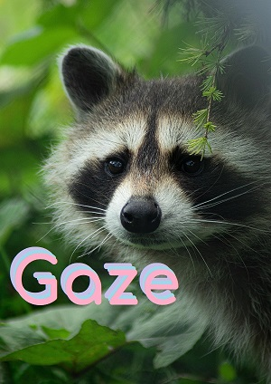

# gaze

## Preface

You find yourself standing on the hill outside your childhood village.
A place you've been many times before but this time everything seems foreign.
The sparse array of calm, small lights you normally see spread through town at this time of night is not to be seen.
Instead, you see disruptive, large flares of light.
And instead of the normal murmur of citizens finishing their day before going home you hear a steady roar of distress.

As you stand in the darkness a small cloaked figure scurries towards you.
You greet the creature with a handful of fruits and nuts that you pull from your pocket.
They take your greeting into their paws and quickly devour it.
Looking down upon them, you see their eyes reflect the distant light, made even more noticeable behind their natural black mask.
They look up to you after eating, swipe at their right whiskers twice, you nod, in a single motion they jump out of their cloak and join the gaze gathered behind you.

You take one last moment to appreciate the irony of joining forces with one of nature's most chaotic forces to combat chaos.
You draw in a deep breathe realizing that many mistakes will be made tonight.
You raise your black, sleeved arm and point towards your home.
You feel the gaze rush around you and see them run down the hill.
You follow behind.

## Introduction

Gaze is a small utility library with the goal of making it easier to process text in Rust.

It's experimental at the moment, the API is likely to change often and it is not optimized at all, so you can play around with it, but don't expect much.
I'm not sure yet if this is even a good idea 🤷

For examples see the tests.
Real world examples will be linked soon.

The main idea is to treat processing text as a stream.
Basically you create an initial instance of Gaze and then run multiple phases against it.
Each phase can work with a different type, so you are most likely only using the Gaze type initially,
but data from Gaze is likely passed throughout phases.
I plan on eventually having Gaze work with Rust's Iterator trait, and support for Stream is also planned if this turns out to work well.

## Goals

 * Provide a straight forward pattern for working with text
 * Provide common helper functions
 * Encourage the use of Fn trait
 * Handle unicode well (thanks to unicode-segmentation)
 * Provide diagnostic information for support tools, error handling, and debugging

Logo picture credit: https://unsplash.com/@marcus_d
